# Image Annotation Website
## 文件目录
```shell
├─Admin
│  └─TaskAdmin
│  └─UserAdmin
├─backend
│  └─backend
│  └─Admin
│  └─ImageAnnotation
│  └─manage.py
├─frontend
│  └─dist
│  └─node_modules
│  └─public
│  └─src  
│  └─test     
```
- Admin: 存储任务、用户信息

- backend: 后端文件夹 
  
  python django + MySQL
  
- frontend: 前端文件夹

  vue + element ui


## 配置运行
- 配置虚拟环境
    ```shell
    cd backend   # 到backend目录下
    mkvirtualenv <django> # 创建虚拟环境<虚拟环境名>
    pip install -r requirements.txt #安装相关包
    workon django # 在虚拟环境下运行
    ```

- 迁移数据库

  在`/backend/ImageAnnotation/settings.py`中有相关的数据库设置，需要在本地的MySQL中创建相应的数据库，并修改USER, PASSWORD, HOST, PORT来连接相应的数据库。
  ```python
  DATABASES = {
        'default': {
            'ENGINE': 'django.db.backends.mysql', # 数据库的类型
            'NAME': 'image_annotation', #所使用的数据库的名字
            'USER': 'root', #数据库服务器的用户
            'PASSWORD': '123456', #密码
            'HOST': '127.0.0.1', #主机
            'PORT': '3306', #端口
        }
    }
  ```
  数据库连接完成后，进行数据库迁移
    ```shell
    python manage.py makemigrations
    python mange.py migrate
    ```

- 运行
  
  前后端已经部署整合完成，直接运行后端`manage.py`文件即可，运行完成后按提示访问 http://127.0.0.1:8000/
    ```shell
    python manage.py runserver
    ```

## 功能介绍

- 登录注册

  登录注册界面提供了账号密码登录和注册功能，主页面设置了隐私路由，如果发现用户没有登录就会重定向到登录界面，界面主要提供了如下功能：

  - 输入用户名或用户邮箱登录网站

  - 填写注册表单的信息，验证正确后可以注册账号。注册账号后自动创建存储用户相关信息的文件夹，用于存储用户上传的图片等资源。

- 图片上传

  - 图片上传界面提供了图片批量上传的功能，并可以实现选择图片的预览。批量上传后将保存到该用户的数据库中，用户可以在之后的任务创建中选择这些图片。

- 视频上传

  - 视频上传界面为用户提供了视频上传功能，用户可以点击提取视频的有效帧并上传，上传后将保存到用户的数据库中。

- 创建任务

  - 在创建任务界面中，用户需要输入任务名、任务描述，并选择图片进行任务的创建。选择图片只能从当前用户已经上传到数据库的图片中进行选择。创建任务界面也支持图片预览功能。

- 任务列表

  - 任务列表将展示当前所有任务的信息，包括任务名称、任务描述、任务状态、创建者和领取者等信息。用户可以在任务列表进行任务的领取，领取后任务列表也会进行信息的更新。

- 图片标注

  - 图片标注界面需要用户选择已领取的任务进行标注，支持自己添加标签，支持导出PascalVoc和createML格式的标签。


## 界面示例

- **注册账号**

  用户登录网站后会先进入登录界面，如果没有账号可以在登录之前点击注册连接进入注册页面。

  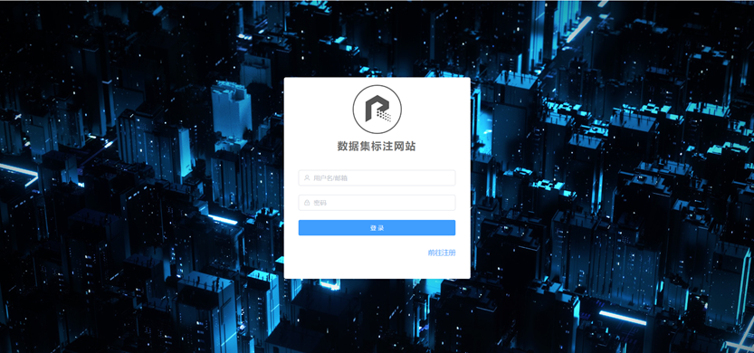

  在注册界面完成了相关信息的填写之后就可以注册账号，需要满足用户名长度和密码长度不小于6，邮箱格式正确，且用户名和邮箱不重复。信息验证成功后才可以注册成功，否则会触发警报。注册成功后，会收到注册成功的提示。

  


- **用户登录**

  用户登录时可以输入用户名或邮箱进行登录，验证密码正确后就可登录进入首页。

  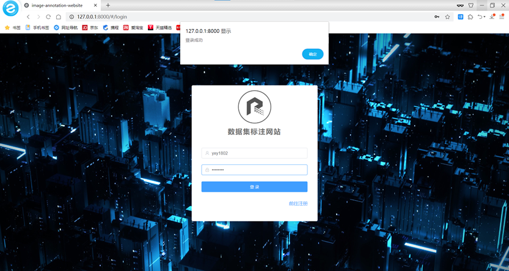


- **进入网站首页**

  进入网站首页后可以看到主页和导航栏。左侧导航栏有各个功能页面的导航，点击后可以跳转到相关功能的界面。主页以卡片的形式展现了各个功能，点击卡片也可以跳转到相应的界面。在上方也以面包屑组件的形式展现了当前打开的页面，其中首页固定。在右上方还可以选择用户相关操作，如退出登录，进入个人中心查看信息。也可以选择全屏功能。

  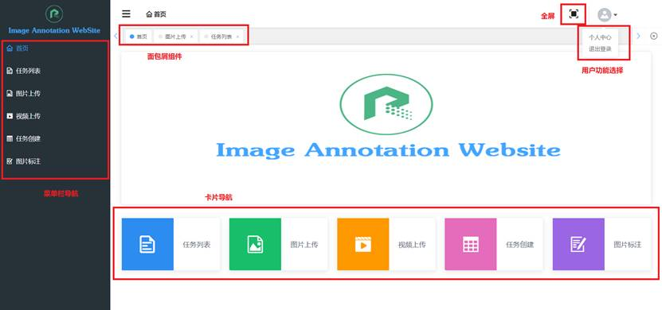


- **退出登录**

  网站的右上角有用户状态，可以选择退出登录，退出登录后会切换到登录界面重新登录。

  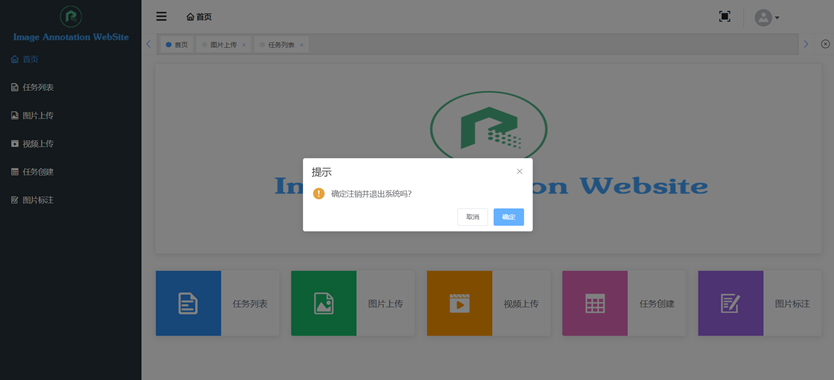

  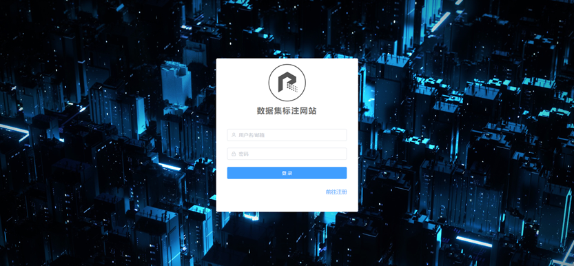


- **查看个人信息**

  网站的右上角有用户状态，可以选择查看个人信息，查看用户名和邮箱。

  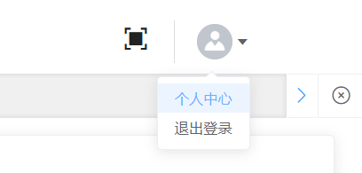

  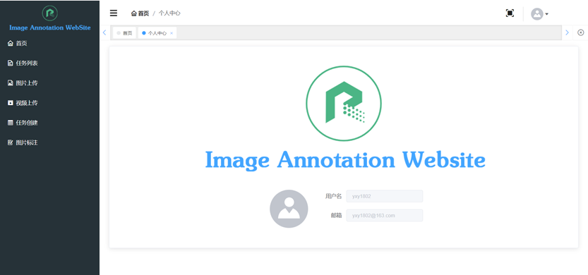


- **图片上传**

  在图片上传界面，可以选择批量上传本地图片。点击卡片选择本地文件，选择完毕后能进行预览，上传成功后会有消息提示上传成功。点击取消按钮可以清楚选择的图片，上传成功后，自动清空预览的图片。

  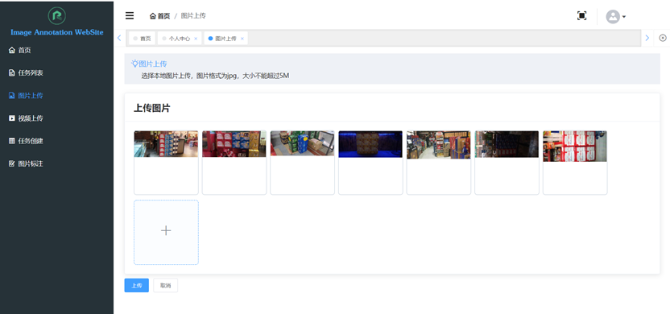

  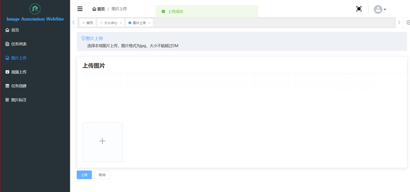


- **视频上传**

  在视频上传界面，在左侧选择文件显示视频，在右侧点击截图按钮提取相关帧，并会以走马灯的形式展现出提取出的帧。选择完毕后，点击提交按钮进行提交，提交成功后会有相关提示。点击取消按钮清空选择的帧。

  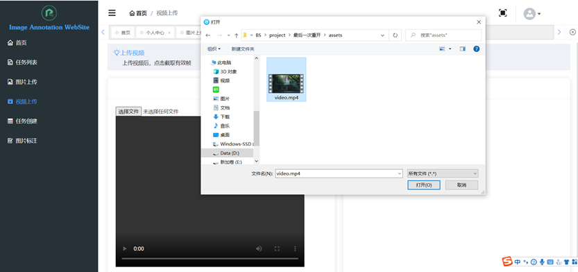

  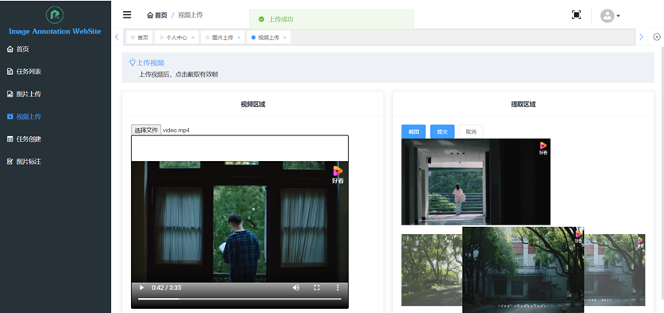


- **任务创建**

  任务创建界面需要输入任务名称和任务描述，并且选择当前用户已经上传的图片来创建任务。选择图片后能够进行预览。点击立即创建，创建成功后会有相关的消息提示。

  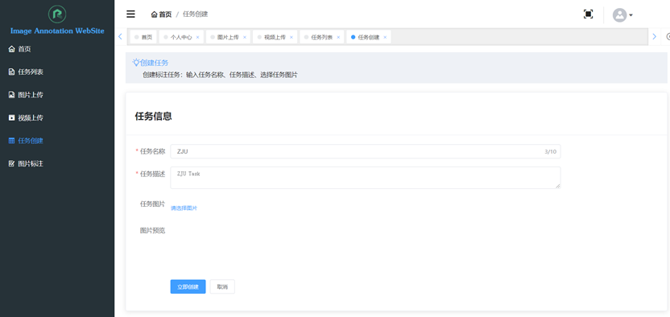

  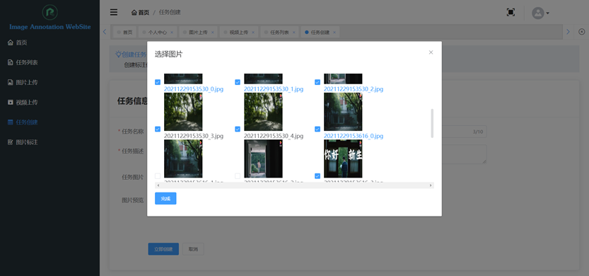

  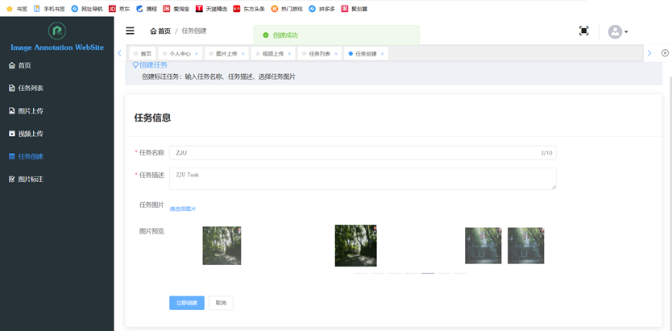


- **任务列表**

  任务列表展示现有的任务名、发布者、任务状态以及领取者。点击任务描述的查看按钮可以查看任务描述，点击领取可以领取任务，点击刷新可以重新加载，获取最新任务列表，点击创建任务会跳转到任务创建界面进行任务创建。

  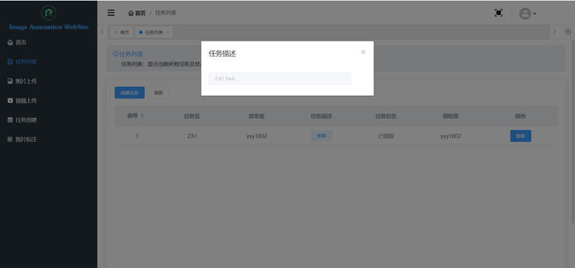


- **图片标注**

  图片标注界面左侧为标注区域，右侧为工具栏。首先选择已领取的任务，点击选择按钮后会在下方以走马灯的形式加载出该任务的图片，点击图片可以在左侧显示。导出数据集时可以选择PascalVoc或createML两种格式。

  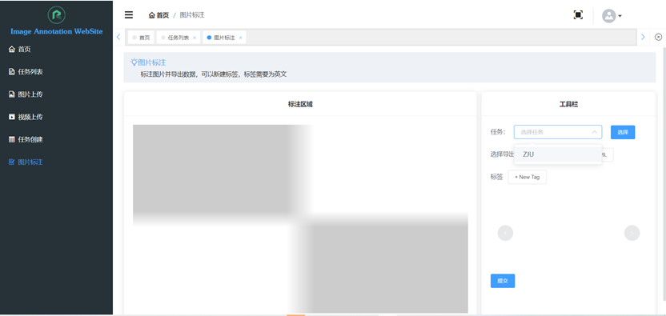

  在标签栏点击+New Tag可以自行输入新建标签，输入完成后点击鼠标即可创建新标签，点击标签右上角的×可以删除标签。需要注意的是，标签需为英文。

  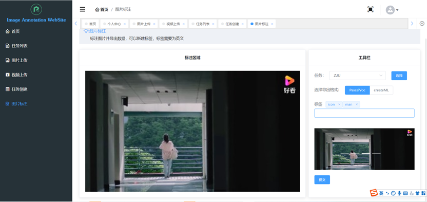

  在左侧的标注区域拖动鼠标绘制矩形进行标注，点击右侧的标签选择相应的标签。绘制矩形区域后，鼠标选中该矩形框后可以拖动其位置，键盘delete键可以删除该标注

  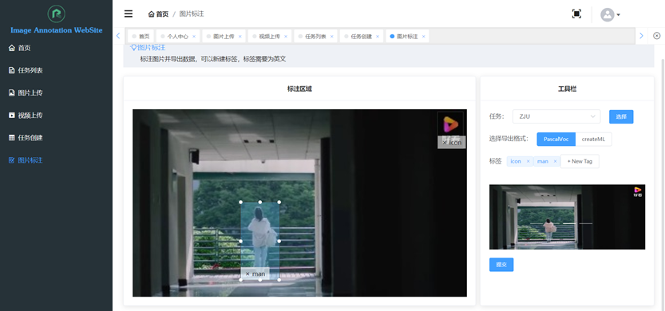

  标注完成后，点击提交按钮即可自动导出所选格式的标注文件，并进行相关提示。导出的标注文件保存在/backend/Admin/Task/<任务名>/Annotations/文件夹下。

  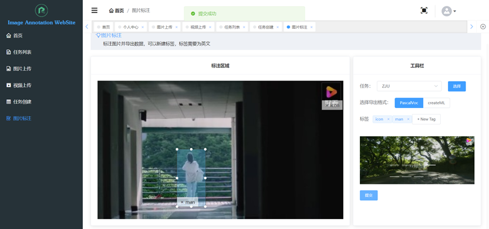

  如图所示，成功导出后，可以看到ZJU文件夹下的Annotation文件夹中多了相关的PascalVoc格式标注文件。

  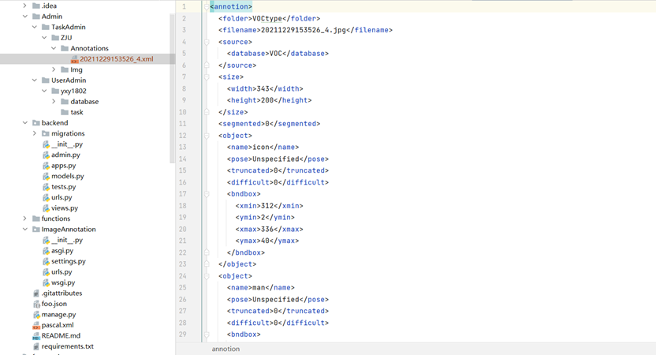

  如果选择的是createML格式，则导出相应的json格式文件。

  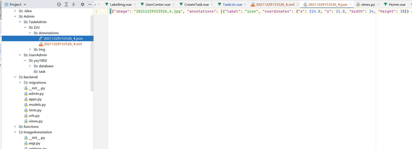
